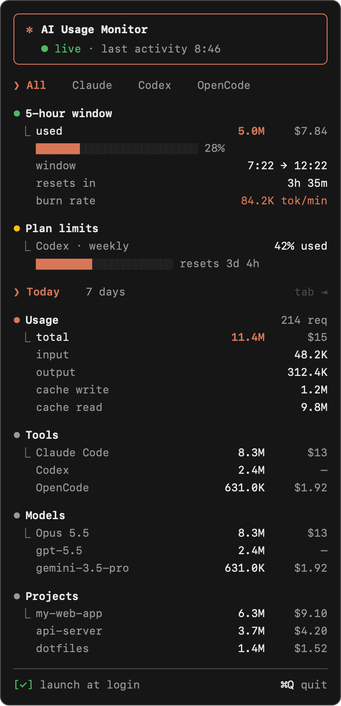
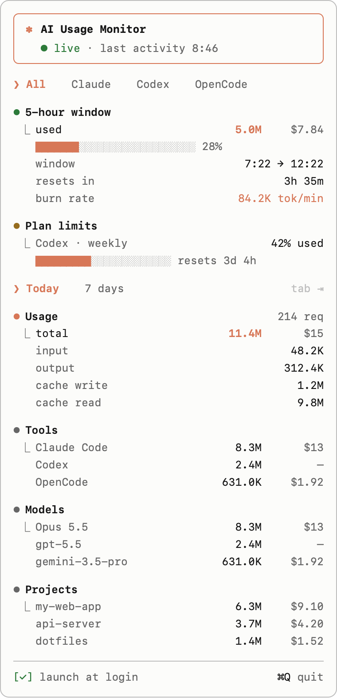

# Claude Usage Monitor

Realtime token usage for your AI coding agents, in the menu bar / system tray, styled like Claude Code.

<p align="center">
  
  &nbsp;
  
</p>

<sub>Screenshots use sample data.</sub>

## Features

- **Realtime:** watches the agents' local log files and updates within a second of each response. No polling, no API keys, no network access.
- **Several agents in one place:**

  | Agent | Where it reads from | What you get |
  |---|---|---|
  | Claude Code | `~/.claude/projects/**/*.jsonl` | Tokens, estimated cost, current 5-hour window |
  | OpenAI Codex CLI | `~/.codex/sessions/**/*.jsonl` | Tokens, plus your **real plan limits** as reported by Codex |
  | OpenCode | `~/.local/share/opencode/opencode.db` | Tokens and OpenCode's own cost for every provider it uses (OpenAI, Gemini, DeepSeek, OpenRouter, …) |
  | Gemini CLI | `~/.gemini/tmp/*/chats/` | Tokens (when session recording is on) |

- **Breakdowns** for today and the last 7 days: by tool, by model and by project, with input, output, cache-write and cache-read tokens.
- **Claude Code look:** monospace text, Claude orange, `⏺ ⎿` sections and `████░░` bars. Follows your system's light or dark theme.
- **Small:** about 5 MB and near-zero CPU while idle.
- **macOS, Windows and Linux.**

## Install

Download the file for your system from the [latest release](https://github.com/stawan15/Claude-Usage-Monitor/releases/latest).

| System | File |
|---|---|
| macOS, Apple Silicon | `Claude.Usage.Monitor_<version>_aarch64.dmg` |
| macOS, Intel | `Claude.Usage.Monitor_<version>_x64.dmg` |
| Windows 10/11 | `Claude.Usage.Monitor_<version>_x64-setup.exe` (or the `.msi`) |
| Linux | `.AppImage`, `.deb` or `.rpm` |

The builds are not code-signed yet, so the first launch needs one extra step:

- **macOS:** open the `.dmg` and drag the app to Applications. If macOS says the app "is damaged" or "can't be opened", run
  `xattr -dr com.apple.quarantine "/Applications/Claude Usage Monitor.app"` once, then open it again.
- **Windows:** if SmartScreen appears, click **More info → Run anyway**.
- **Linux:** for the AppImage, run `chmod +x Claude*.AppImage` and start it. Your desktop needs tray/app-indicator support. On GNOME, install the *AppIndicator and KStatusNotifierItem Support* extension.

## Usage

- **Click the ✻ tray icon** to open the panel. On macOS the icon also shows today's total. Elsewhere, hover over it to see the total.
- **Right-click** the icon for **Open** and **Quit**. On Linux the menu is the only way to open the panel.
- In the panel, **Tab** switches between Today and 7 days, **Esc** closes it, and **⌘Q / Ctrl+Q** quits.
- Tick **launch at login** at the bottom to start it automatically.

## Costs

Costs are estimates of what the same usage would cost on the pay-as-you-go API. On a subscription plan (Claude Pro/Max, ChatGPT) you are not billed per token.

- **Claude models:** priced from Anthropic's published API rates. Cache rates that aren't published use the standard multipliers (cache write 1.25× input, cache read 0.1× input).
- **OpenCode:** uses the cost that OpenCode itself records.
- **Other models:** show **—** until you add a price. Create `~/.config/claude-monitor/pricing.json` with USD per million tokens (the longest matching model-name prefix wins):

  ```json
  {
    "gpt-5.5": { "input": 1.25, "output": 10, "cacheWrite": 0, "cacheRead": 0.125 }
  }
  ```

  Restart the app after editing the file. The numbers above are an example, not real prices.

## How the numbers are counted

- **Tokens** = input + output (including reasoning/thinking) + cache write + cache read, per API response. Claude Code logs every content block of a response separately, so they are de-duplicated by message and request id.
- **5-hour window:** an estimate of how Claude plan limits reset. It starts at the top of the hour of your first Claude Code request after the previous window ended and lasts 5 hours. Anthropic doesn't publish per-plan token limits, so the panel shows how much you've used, not how much is left.
- **Plan limits:** shown only when a tool records them locally. Today that's Codex (`rate_limits` in its session logs).
- **Custom log folders:** `CLAUDE_CONFIG_DIR`, `CODEX_HOME`, `XDG_DATA_HOME` and `GEMINI_CLI_HOME` are respected.

## Build from source

You need [Rust](https://rustup.rs), [Bun](https://bun.sh) (or Node.js) and the [Tauri prerequisites](https://v2.tauri.app/start/prerequisites/) for your OS.

```sh
git clone https://github.com/stawan15/Claude-Usage-Monitor.git
cd Claude-Usage-Monitor
bun install
bun run dev      # run in development
bun run build    # build installers into src-tauri/target/release/bundle/
```

Run the tests with `cd src-tauri && cargo test`.

### Project layout

```
ui/                     Panel UI (plain HTML/CSS/JS, no build step)
src-tauri/src/
  providers/            One reader per agent: claude.rs, codex.rs, opencode.rs, gemini.rs
  watcher.rs            File watching (FSEvents / inotify / ReadDirectoryChangesW via `notify`)
  store.rs              Aggregation into today / 7 days / 5-hour window
  pricing.rs            Price table and overrides
  lib.rs                Tray icon, panel window, commands
```

To support another agent, add a file in `providers/` that implements the `Provider` trait and register it in `providers/mod.rs`.

### Releasing

Bump the version in `src-tauri/tauri.conf.json`, `src-tauri/Cargo.toml` and `package.json`, then push a tag:

```sh
git tag v0.2.0 && git push origin v0.2.0
```

GitHub Actions then builds macOS (Apple Silicon and Intel), Windows and Linux installers and publishes the release.

## Privacy

Everything stays on your computer. The app only reads the log files listed above and never sends anything over the network.

## License

[MIT](LICENSE)

This is an independent community project. It is not affiliated with, or endorsed by, Anthropic, OpenAI, Google or the OpenCode project. "Claude" is a trademark of Anthropic.
